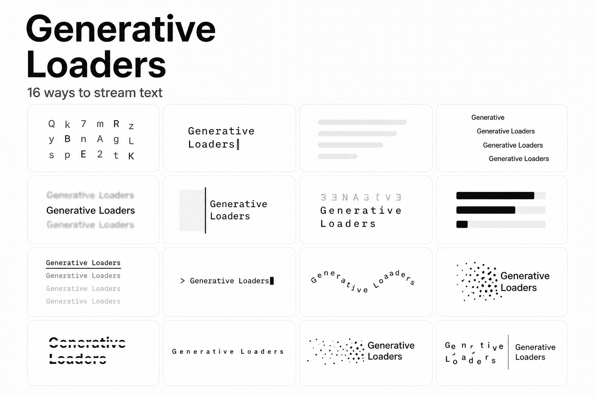

# Generative Loaders

[](https://github.com/kasturikhanke/generative-loaders/actions/workflows/ci.yml)
[](https://www.npmjs.com/package/generative-loaders)
[](https://www.npmjs.com/package/generative-loaders)
[](./LICENSE)

Accessible React loading states designed for generative interfaces: sixteen animated text reveals, fourteen compact activity indicators, and nine image-generation placeholders.

[Live gallery](https://generativeloaders.com) · [Documentation](https://generativeloaders.com/docs) · [npm](https://www.npmjs.com/package/generative-loaders) · [Report an issue](https://github.com/kasturikhanke/generative-loaders/issues/new/choose)



## Install

```bash
npm install generative-loaders
```

The package supports React 18 and newer.

## Quick start

Import the component you need and include the stylesheet once near your application root.

```tsx
import { ImageLoader, InlineLoader, TextLoader } from "generative-loaders";
import "generative-loaders/styles.css";

export function GeneratingAnswer({ text }: { text: string }) {
  return <TextLoader text={text} variant="decode" />;
}

export function PendingStatus() {
  return <span><InlineLoader variant="orbit" /> Thinking…</span>;
}

export function PendingImage() {
  return <ImageLoader variant="tiles" size={192} label="Generating product image" />;
}
```

## Three primitives

| Component | Use it for | Included variants |
| --- | --- | ---: |
| `TextLoader` | Responses that grow as tokens or chunks arrive | 16 |
| `InlineLoader` | Buttons, status rows, and the wait before text arrives | 14 |
| `ImageLoader` | Reserved image frames while generation is in progress | 9 |

### Streaming text

Pass the complete response received so far—not only the newest token. `TextLoader` keeps the existing prefix stable and animates only the newly appended suffix.

```tsx
"use client";

import { useState } from "react";
import { TextLoader } from "generative-loaders";
import "generative-loaders/styles.css";

export function StreamingAnswer() {
  const [text, setText] = useState("");

  async function generate() {
    setText("");
    const response = await fetch("/api/generate", { method: "POST" });
    if (!response.ok || !response.body) throw new Error("Generation failed");

    const reader = response.body.getReader();
    const decoder = new TextDecoder();

    while (true) {
      const { value, done } = await reader.read();
      if (done) break;
      setText((current) => current + decoder.decode(value, { stream: true }));
    }
  }

  return <TextLoader text={text} variant="cascade" />;
}
```

## Variants

**Text:** `decode`, `typewriter`, `skeleton`, `cascade`, `focus`, `wipe`, `flip`, `redact`, `line`, `terminal`, `wave`, `dissolve`, `slice`, `tracking`, `coalesce`, `fragments`

**Inline:** `glyph`, `matrix`, `orbit`, `ripple`, `signal`, `spark`, `rotor`, `pixel-drift`, `chomp`, `snake`, `fold`, `gravity`, `domino`, `aperture`

**Image:** `skeleton`, `bands`, `tiles`, `scan`, `pixel-grid`, `resolution`, `focus`, `shutter`, `contour`

See every variant, speed control, and usage context in the [live gallery](https://generativeloaders.com).

## API

### `TextLoader`

| Prop | Type | Default |
| --- | --- | --- |
| `text` | `string` | required |
| `variant` | `TextLoaderVariant` | required |
| `color` | CSS color string | `"#111111"` |
| `speed` | positive number | `1` |
| `paused` | `boolean` | `false` |
| `className` | `string` | — |
| `aria-label` | `string` | normalized `text` |

`InlineLoader` accepts `variant`, `size`, `color`, `speed`, `paused`, `className`, and an optional accessible `label`.

`ImageLoader` accepts `variant`, `size`, `color`, `radius`, `speed`, `paused`, `className`, and `label`. Its default label is “Generating image.”

All prop and variant types are exported from the package root.

## Accessibility and behavior

- `TextLoader` exposes received text through a polite live status while keeping decorative animation layers hidden from assistive technology.
- `InlineLoader` avoids duplicate announcements when adjacent text already describes the activity; add `label` when it stands alone.
- Every loader respects `prefers-reduced-motion` and retains a meaningful static state.
- Text updates are append-aware, so previously received content does not reanimate.
- Components render stable server markup and are safe to use in SSR applications.
- Invalid, zero, or negative speed values safely fall back to `1`.

## Development

This repository is an npm workspace containing the package and its live gallery.

```bash
npm install
npm run dev
```

Before opening a pull request, run:

```bash
npm test
npm run lint
npm pack --workspace generative-loaders --dry-run
```

See [CONTRIBUTING.md](./CONTRIBUTING.md) for the full workflow. For help using the package, read the [documentation](https://generativeloaders.com/docs) or [open an issue](https://github.com/kasturikhanke/generative-loaders/issues/new/choose).

## License

[MIT](./LICENSE) © Kasturi Khanke and Generative Loaders contributors.
